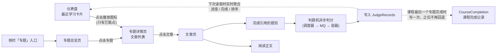
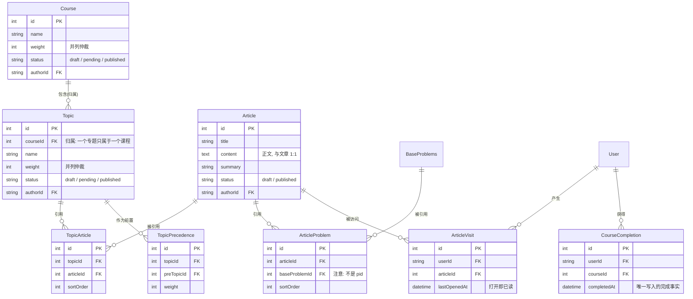
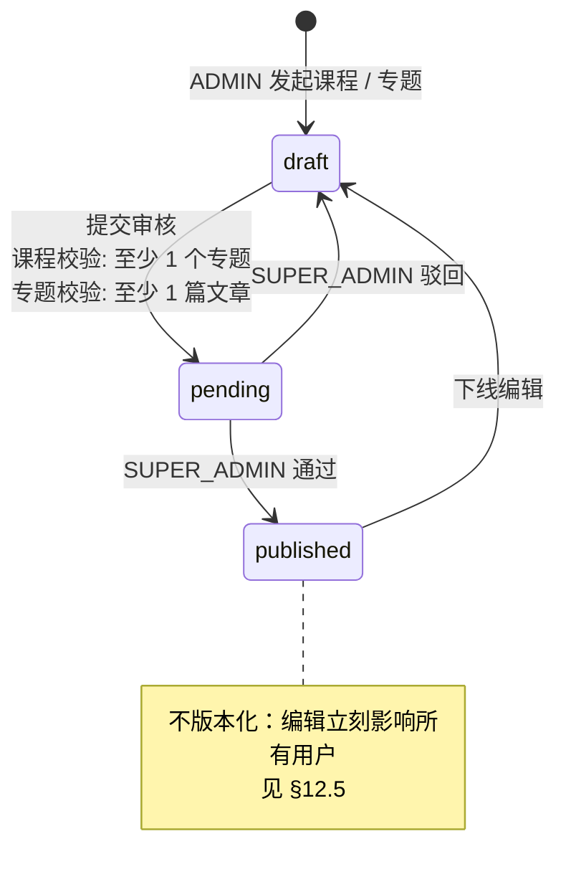
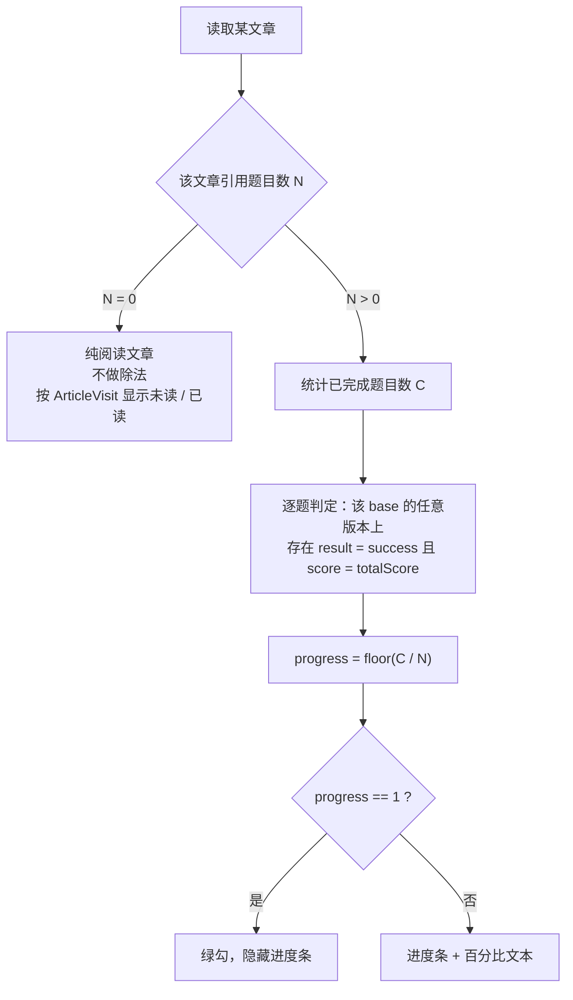
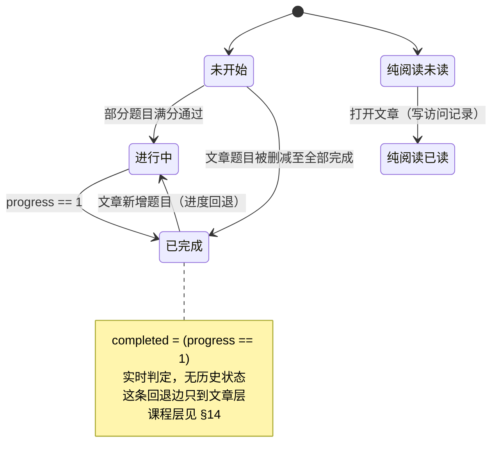
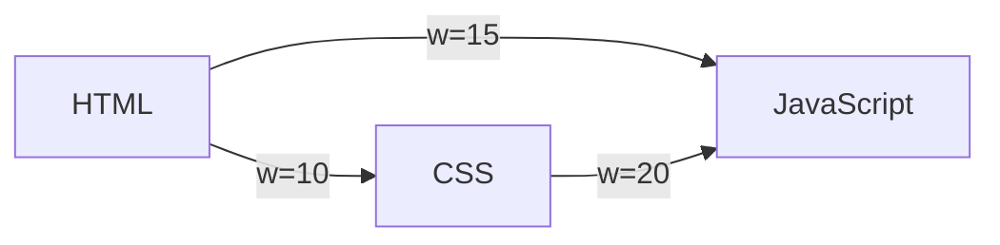
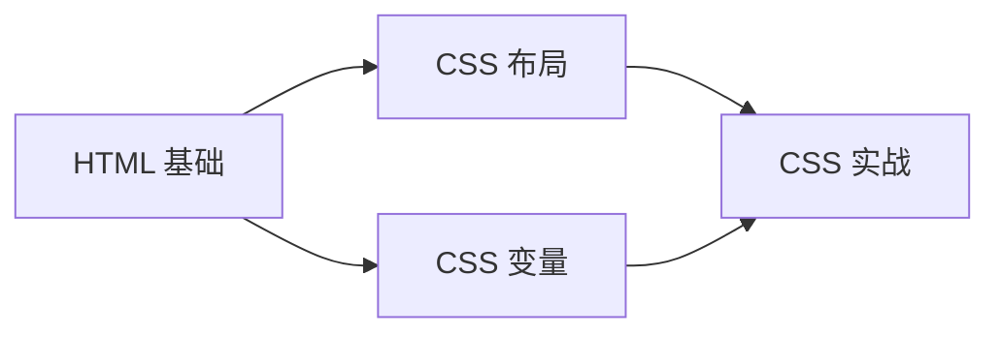
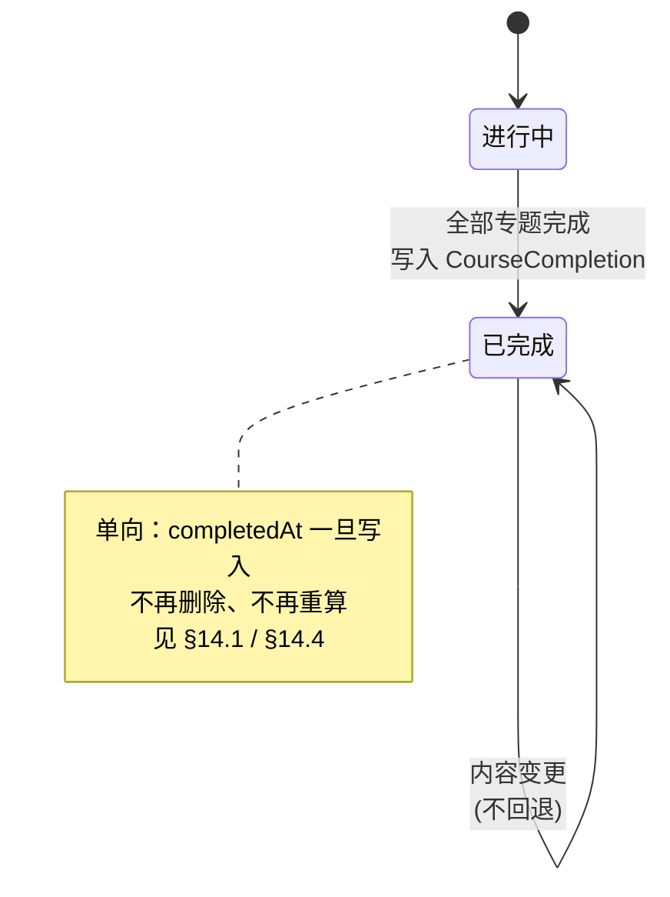

# 学习系统（课程 / 专题 / 文章 / 题目）设计草案

> **状态**：Draft（待评审）
> **版本**：v0.3
> **作者**：Felix
> **日期**：2026-10-08
> **评审人**：待指定
> **适用仓库**：`quanta-challenge`
> **涉及包**：`packages/challenge-web-app`、`packages/database`

## 变更记录

| 版本 | 日期 | 变更 | 作者 |
| --- | --- | --- | --- |
| v0.1 | 2026-10-08 | 初稿。内容来自「最近学习」板块功能的需求讨论 | Felix |
| v0.2 | 2026-10-08 | 新增 §8.8：题目版本变更不重算已完成章节；引用题目被删除时标注不可用并按已完成计入 | Felix |
| v0.3 | 2026-10-08 | 重构为「课程 → 专题 → 文章 → 题目」四层：专题改为**引用**文章而非拥有文章，文章成为可独立存在的一等实体（原「章节」并入文章）；**反转 §2.1 的用词禁令**，「课程」二字重新启用、「章节 / 课时」停用；课程完成改为**单向**（§14 覆盖 §8.3 的课程层语义）；新增文章编辑页单独成页与 MDX 插入题目（§13）、发布校验（§15），并更新仪表盘「最近学习」的行与动作图标（§4.1、§8.5） | Felix |

---

## 0. 文档约定

本文是**需求 + 设计混合草案**：前半段对齐「做什么、给谁、怎样算完成」，后半段是技术设计。全文使用统一标记区分已决与未决，阅读时请以标记为准，不要以段落位置推断。

| 标记 | 含义 |
| --- | --- |
| `[已决策]` | 已拍板。改动需要走变更记录，不能随手改 |
| `[待定]` | 尚未拍板。**必须**带暂定选择与重审条件 |
| `[模型]` | 概念层定义。以「模型自洽」为标准，允许后续调整 |
| `[v1]` | 第一期承诺实现 |
| `[v2+]` | 明确推迟。写在此处只是为了让模型不歪 |

四条撰写约定：

1. 每个决策都必须写出**理由**与**代价**。只写结论的决策不算决策。
2. 不允许出现裸的「待定」——每个待定项都要有暂定值和重审条件。
3. §2 术语表是全文唯一的词汇来源。正文不得另行造词或使用同义词。
4. 图表使用 **Mermaid** 绘制，在 GitHub、VS Code（Mermaid 插件）或 Typora 中可直接渲染；纯文本查看器下即为代码块，不影响阅读。

> **v0.3 阅读提示**：本文 v0.1 / v0.2 的「专题 / 章节 / 题目」三层模型已被四层模型取代。凡涉及旧层级处，本文要么直接改写，要么在原处标注 `⚠️ 已被 v0.3 覆盖`。看到该标记时，**以标记后的文字为准**。

---

## 1. 问题陈述

### 1.1 现状

平台目前只有「题库」一条消费路径：用户可以刷题、看判题结果、上榜，但不存在「成体系地学一门知识」的路径。仪表盘上的「最近学习」卡片已经是占位实现（`RecentLearningCard.vue`，空状态文案为「暂无学习课程」），搜索配置里也已注册 `dashboard-recent-learning`，但背后**没有任何数据模型支撑**。

### 1.2 为什么现在做

卡片是一个空壳。继续放着，等于持续向用户暴露一个不可用的功能；而要做它，就必须先有内容组织层，否则卡片无从计算内容。

### 1.3 目标

> 引入「**课程 → 专题 → 文章 → 题目**」的内容组织层，让用户能按体系学习，并让仪表盘的「最近学习」卡片显示其真实的、按最近访问排序的**课程 / 专题**进度。

v0.1 的目标只到「专题 → 章节 → 题目」。v0.3 之所以再加一层课程，是因为「专题」这个词同时承担了两个粒度：既是「一门知识体系」（HTML / CSS / JavaScript 的集合），又是「一个知识领域」（HTML）。前者需要排序、需要里程碑、需要完成；后者只需要被引用。把两者拆开之后，专题才能干净地退化成「文章的引用集合」。

### 1.4 不做会怎样

平台停留在「题目集合」形态，缺少内容组织与教学路径，用户留存只能依赖每日一题这类短期机制。

---

## 2. 术语表

本节是全文唯一词汇来源。每条包含**反例**字段——它是防止歧义最有效的一栏，请勿省略。

| 中文名 | 英文标识 | 定义 | 反例（它不是什么） |
| --- | --- | --- | --- |
| 课程 | `Course` | 一门可被完整学完的知识体系，是**专题的集合**，同级平铺、不嵌套。例：前端基础 | 不是专题的上级分类树；课程**不包含**课程；**可以为 0 个专题**（但 0 专题不可发布，见 §15） |
| 专题 | `Topic` | 一个知识领域的**文章引用集合**。例：HTML / CSS / JavaScript | 不是文章的容器；专题**不拥有**文章，只是引用；专题**可以为 0 篇文章** |
| 文章 | `Article` | **一等实体**：一篇有正文、可引用题目的内容单元。粒度为「布局」这一级（flex、grid 属于文章内部内容） | 不是专题的私有配件；文章**不隶属于任何专题**，可被 0 个或多个专题引用 |
| 文章正文 | `Article.content` | 文章的正文内容，与文章 1:1 | 不是独立实体；不存在「一篇文章对应多篇正文」 |
| 题目 | `Problem` | 复用现有 `Problems` 体系的可判题练习 | 不是文章；题目不隶属于任何专题或课程 |
| 专题引用 | `TopicArticle` | 专题与文章之间的多对多关联，带 `sortOrder` | 不是归属——一篇文章可被多个专题引用，也可独立存在于内容库 |
| 文章引用 | `ArticleProblem` | 文章与题目之间的多对多关联（即 v0.2 的 `ChapterProblem`） | 不是归属——一道题可被多个文章引用，也可独立存在于题库 |
| 学习进度 | `progress` | 某文章下「用户已满分通过的题目数 ÷ 该文章题目总数」，**实时派生** | 不是历史事实；不落库、不缓存 |
| 文章完成 | `completed` | 定义即 `progress === 1` | **不是「曾经完成」**；文章层不保存历史完成状态 |
| 课程完成 | `CourseCompletion` | 课程下**全部专题**首次全部完成这一历史事件，**落库且单向**（见 §14） | 不是实时派生值；不随内容变化回退 |
| 文章访问记录 | `ArticleVisit` | 用户最近一次打开某文章的时间戳 | 不等于「读过」——本设计采用**打开即已读**；也不是 `users.lastActiveAt` |
| 排序权重 | `weight` | 课程、专题在总览页排列时用于并列仲裁的数值 | 不是前置条件，不控制访问 |
| 先后关系 | `precedence` | 专题之间的有向无环依赖，**仅影响展示顺序** | 不是强制前置；不阻止用户进入任何专题 |

**三个词的关系，一句话**：课程**集合**专题，专题**引用**文章。三者之间只有一处是「归属」（专题属于课程，`Topic.courseId`），另外两处都是「引用」（专题 ↔ 文章、文章 ↔ 题目）。同一个「引用」语义在两层上完全一致：**被引用者独立存在，可以不被任何一方引用，也可以被多方同时引用。**

### 2.1 特别声明（用词的反转与保留）

> **本项目没有「订阅」概念。**
>
> **本次反转**：v0.1 / v0.2 曾规定「不再使用『课程』与『课时』这两个词」。v0.3 **重新启用「课程」**，把它提升为最上层实体；同时**停用「章节」与「课时」**。
>
> 变更后仍然禁止的词：**章节、课时、订阅**。

反转的理由与代价：

- **理由**：「课程」是中文里对「一门可学完的知识体系」最自然的词，而 v0.1 当初禁用它的原因是「与『课时』只差一个字、连读同形」。现在把一个明确的层级概念（专题的集合）指派给它之后，它与「课时」的混淆风险由「层级位置」消除——课程是容器，课时根本不是一个实体。
- **代价**：本文 v0.1 / v0.2 的历史段落、以及仓库中既有的「章节」文案（`app/pages/app/**` 下的若干处）必须逐处改掉；任何遗漏都会让读者在两套词汇之间来回翻译。迁移时以「章节 → 文章」为唯一映射，不做一对多的拆分。

---

## 3. 范围

### 3.1 In scope

- 内容组织：课程、专题、文章、文章正文、专题对文章的引用、文章对题目的引用 `[v1]`
- 仪表盘「最近学习」卡片：显示**课程 / 专题**、进度、完成状态，按最近打开时间排序 `[v1]`
- 文章页：正文 + 引用题目 + 提交入口 `[v1]`
- 文章访问记录 `[v1]`
- 文章编辑页（单独成页，MDX 插入题目，语雀式工具栏） `[v1]`（见 §13）
- 课程完成记录与单向完成判定 `[v1]`（见 §14）
- 发布侧：发起课程、发起专题、引用文章、引用题目、送审 `[v2+]`
- 专题审核界面 `[v2+]`、课程审核界面 `[v2+]`
- 专题总览页（左侧新增导航入口）、文章总览页 `[v2+]`、课程总览页 `[v2+]`

### 3.2 Out of scope（明确不做）

| 不做的事 | 原因 |
| --- | --- |
| 强制前置 / 解锁 / 锁定状态 | `[已决策]` 所有专题随时可进入，不做访问控制 |
| 专题 / 文章的版本化 | `[已决策]` 直接编辑，不保留历史版本。**理由**：专题与文章属于内容编排，体量小、变更频率低；版本化会把引用关系、进度统计与审核流程一并复杂化。**代价**：发布后的编辑立刻影响所有用户，见 §12.5 |
| 订阅 / 关注 / 收藏 | `[已决策]` 概念已删除，见 §2.1 |
| 课程封面图 | `[已决策]` `[v1]` 卡片图标固定，不存封面 |
| 「…」菜单功能 | `[待定]` v1 不渲染该按钮，见 §10 |
| 文章内部的多层结构 | 课程层与专题层平级，文章层单层 |
| 学习时长统计、笔记、证书 | 未讨论，不在本期 |

### 3.3 与其他入口的关系 `[已决策]`

课程、专题与题库是**两条独立入口**：

- **题库**保持现状——支持按标签、难度筛选与查找，可浏览全部题目。本设计**不改变题库的任何行为**。
- **课程 / 专题**是新增的独立入口，只**引用**题库中的部分题目，不影响题目自身的归属、状态与筛选维度。
- 因此同一道题可能同时存在于题库和若干文章中，这是预期行为。其后果见 §8.7。

---

## 4. 用户场景

1. **新用户**：首次打开仪表盘，卡片显示空状态「暂无学习记录」并提供前往专题总览的入口。
2. **学习**：侧栏进入专题总览 → 点「CSS」→ 专题详情（文章列表）→ 点「布局」→ 打开文章页，阅读正文，完成引用题目，判题满分通过。
3. **回到仪表盘**：卡片出现一行「前端基础 / CSS」，进度 40%，右侧为播放图标。
4. **完成一篇**：文章内全部题目满分通过 → 进度 100%，进度条被绿色对勾取代。
5. **纯阅读文章**：文章没有引用任何题目时不显示进度条，只显示「未读 / 已读」。
6. **题库刷题**：用户在题库里做对了某道题，而该题恰好被某文章引用 → 该文章进度上涨；但由于没有访问记录，其所在专题**不会**出现在「最近学习」卡片中。
7. **完成一门课程**：课程下最后一个专题完成 → 写入一次课程完成记录；此后即便课程里补了新文章，完成状态**不摘除**（§14）。
8. **管理员发布** `[v2+]`：ADMIN 进入发布页发起专题，填写名称与权重、选择前置专题、**引用已有文章**、文章内引用已发布题目 → 送审 → SUPER_ADMIN 审核通过 → 上架；课程同理，但 0 专题的课程不能发布（§15）。

### 4.1 学习路径总览



注意图中那条指向卡片的虚线：卡片的数据**不是**判题时写进去的，而是下次读取时从 `JudgeRecords` 现算的（§8）。它与指向 `CourseCompletion` 的虚线是本设计里**唯一**两条写路径，二者方向相反：文章完成可以回退，课程完成不可以（§14）。

`⚠️ 已被 v0.3 覆盖`：v0.2 的这张图里，卡片行的点击目标是「章节文档页」。现在整行**不是**链接，只有未完成行的播放图标能点进专题详情页（§8.5）。

---

## 5. 现有系统约束

以下约束会直接影响设计，逐条列出以便评审时核对。

| # | 约束 | 对设计的影响 |
| --- | --- | --- |
| 5.1 | 题目是**双表版本化**的：`BaseProblems` 是稳定身份，`Problems`（`pid`）是版本快照，且有 `isDeprecated` | 文章引用题目必须选定锚点，见 §6.3 |
| 5.2 | 判题是**异步**的：Web → 调度器 → MQ → 判题机容器 → 回调 | 本设计只在判题回调侧增加**一处**写入点（课程完成记录，§14），进度本身仍然只读 |
| 5.3 | `JudgeRecords`（`userId` / `problemId` / `score` / `result` / `createdAt` / `type`）是个人判题事实表 | 这是「题目完成」的**唯一事实来源，无需新建** |
| 5.4 | ⚠️ `JudgeStatus`（`passedCount` / `totalCount`）是**全站统计**，不是个人进度 | **不得**用于个人进度计算。`RecentSubmissionCard` 用它算「平均通过」是正确的，容易误用 |
| 5.5 | ⚠️ `users.lastActiveAt` 是**用户级**活跃时间，由 `track-active.ts` 以 5 分钟窗口节流写入 | 粒度是「用户」而非「文章」，**不能**用于专题排序，也**不能**用于「已读」判定。需要新的 `ArticleVisit` 表；其写入应复用同样的节流思路 |
| 5.6 | 权限体系 `UserRole = SUPER_ADMIN / ADMIN / USER` | 「管理员及以上」等价于侧栏现有的 `role !== 'USER'` 判断，直接复用，不新造 |
| 5.7 | 侧栏是硬编码列表（`Sidebar/index.vue`） | 新增导航入口成本很低 |
| 5.8 | 发布流程已有成型模板：`publish/problem`、`publish/achievement`、`publish/create-tag`，形状为 `index.vue` + `_composables/use-*-publication-form.ts` + `_modules/*Picker.vue` | 专题发布页照 `publish/achievement` 复刻；其 `PreAchievementsPicker.vue` 是**前置选择器的现成先例**，而「引用文章」需要一个新的 `ArticlePicker` |
| 5.9 | ⚠️ 成就系统存在循环依赖屏蔽（`invalidFieldsPattern` 中的 `/^achievement.*/`） | 学习完成若要触发成就，会撞上同一问题。见 §12.6 |
| 5.10 | 数据库迁移必须使用 `pnpm prisma:update` | 不得直接运行 `prisma migrate` |
| 5.11 | 题目审核是**机器审计**（跑判分脚本验证参考解能满分）；专题审核是**人审** | 两者不应共用同一张审核表的语义，见 §12.5 |
| 5.12 | 现有 Markdown 渲染链是 `marked`（`use-markdown.ts`），编辑器是 `StTextarea` + 预览面板 | 引入 MDX（§13）后会出现**两条渲染链**。必须明确边界：文章正文走 MDX，题目描述等其它字段继续走 `marked` |

---

## 6. 数据模型草案

### 6.1 实体清单

| 实体 | 说明 | 期次 |
| --- | --- | --- |
| `Course` | 课程。`id` / `name` / `weight` / `status` / `authorId` | `[v1]` 模型，`[v2+]` 写入 |
| `Topic` | 专题。`id` / `courseId` / `name` / `weight` / `status` / `authorId` | `[v1]` 模型，`[v2+]` 写入 |
| `Article` | 文章。`id` / `title` / `content`（正文）/ `summary` / `status` / `authorId`。**没有 `topicId`** | `[v1]` |
| `TopicArticle` | 专题**引用**文章。`topicId` / `articleId` / `sortOrder`，唯一约束 `(topicId, articleId)` | `[v1]` |
| `ArticleProblem` | 文章**引用**题目。`articleId` / `baseProblemId` / `sortOrder` | `[v1]` |
| `TopicPrecedence` | 专题先后边。`topicId` / `preTopicId` / `weight`，唯一约束 `(topicId, preTopicId)` | `[v1]` 模型 |
| `ArticleVisit` | 文章访问记录。`userId` / `articleId` / `lastOpenedAt`，唯一约束 `(userId, articleId)` | `[v1]` |
| `CourseCompletion` | 课程完成记录。`userId` / `courseId` / `completedAt`，唯一约束 `(userId, courseId)` | `[v1]` |
| `TopicAuditRecord` | 专题人审记录。与题目的机器审计分开 | `[v2+]` |

读法：**三张内容表**（`Course` / `Topic` / `Article`）+ **两张引用表**（`TopicArticle` / `ArticleProblem`）。`TopicPrecedence` 是辅助排序边，`ArticleVisit` / `CourseCompletion` 是用户侧事实表，都不算在「三张表 + 两张引用表」里。

### 6.2 关系

- `Course` 1:N `Topic`——**这是全文唯一的「归属」关系**，`Topic.courseId` 是普通外键
- `Topic` N:M `Article`，经由 `TopicArticle`——**引用，不是归属**。`Article` 表里没有 `topicId`，因此「文章属于哪个专题」这个问题在设计上不存在
- `Topic` N:M `Topic`，经由 `TopicPrecedence`，**必须无环**
- `Article` N:M `BaseProblems`，经由 `ArticleProblem`——注意引用的是 **base**，不是 `pid`
- `User` N:M `Article`，经由 `ArticleVisit`
- `User` N:M `Course`，经由 `CourseCompletion`（单向，只增不减）



读法：`Topic ||--o{ TopicPrecedence` 表示「一个专题对应多条以它作为**前置**的边」。`TopicPrecedence.topicId` 同样外键指向 `Topic`（表示这条边的**后继**是谁），图中省略这条连线以避免两条边重叠——它构成一个自引用的 N:M 关系，也就是 §9 的 DAG。

关键差别：`Topic` 表里有 `courseId`，`Article` 表里**没有** `topicId`。前者是归属，后者是引用——这条不对称正是本次重构的核心。

### 6.3 关键决策：文章引用题目的锚点 `[已决策]`

**存 `baseProblemId`（`BaseProblems.id`），不存 `pid`。**

- **理由**：专题与文章不版本化，内容应跟随题目的最新版本。存 `pid` 会让文章钉死在一个可能被废弃（`isDeprecated`）的旧快照上，用户点进去会看到「已废弃」。
- **代价**：题目升版若改动了分值上限，必须靠 §8.1 的「跨版本满分」规则兜住，否则用户进度会莫名回退。
- 想更换引用的题目时，**只能删除后重新引用**，不提供「改指向」的操作。

### 6.4 明确不落库的派生数据

列出这一节是为了防止后来者「顺手加个字段」。以下均为实时派生，**不得**落库或缓存：

- 文章进度百分比
- 文章是否完成
- 专题进度、专题是否完成
- 课程进度百分比
- 卡片排序结果

理由见 §8 开头：本设计采用**混合方案**——事实表是唯一真相，聚合值现算。

> ⚠️ **v0.3 增加一个例外**：`CourseCompletion`（课程完成记录）**必须落库**。见 §14——「一旦完成不再回退」在定义上就不是实时派生，它无法从 `JudgeRecords` 重放出来，只能作为历史事件保存。这是全文唯一被允许落库的「聚合类」数据，其余仍然一律现算。

### 6.5 引用约束 `[已决策]`

| 约束 | 说明 |
| --- | --- |
| 只能引用**已发布**的题目 | 即题目 `Status === published`。否则作者可引用草稿题，用户点进去 404 |
| 只能引用**已发布**的文章 | 专题在上架前引用的文章必须是已发布状态；否则用户点进去看到不可见内容 |
| 校验必须在**服务端** | 前端过滤挡不住直接调接口 |
| 可被多个文章引用 | 同一道题出现在多个文章中是预期行为，因此完成判定需要考虑 fan-out（读取侧，见 §8.1） |
| 一篇文章可被多个专题引用 | 这是引用语义的必然结果，不是数据错误。界面上要能看出「这篇文章还出现在别处」（§8.5） |
| 改引用只能重新引用 | 不提供「改指向」操作，删除后重新添加（§6.3） |

### 6.6 状态机 `[v2+]`

发布专题时**至少要引用 1 篇文章**；发布课程时**至少要包含 1 个专题**（§15）。为了让表单不必在一次性提交里填完全部内容，约束落在状态机而不是表单上：允许先建空的课程或专题，但不可送审。



`⚠️ 已被 v0.3 覆盖`：v0.2 此处写的是「至少 1 个章节」；现在是「至少 1 篇文章」，并新增课程层的「至少 1 个专题」。

### 6.7 文章的独立存在 `[已决策]`

文章的三种存在形态都是合法的，模型必须同时支持，不需要额外开关：

| 形态 | 数据表现 | 界面表现 |
| --- | --- | --- |
| 被 1 个专题引用 | `TopicArticle` 有 1 行 | 出现在该专题的文章列表里 |
| 被 N 个专题引用 | `TopicArticle` 有 N 行 | 每个专题的列表里都出现；文章页上列出「还被哪些专题引用」 |
| 不被任何专题引用 | `TopicArticle` 无行 | 不出现在任何专题列表里；只能从文章自己的入口（`/app/articles/:articleId`）访问 |

第三种形态是本次重构的直接结果，也是「文章是一等实体」的判据：**删掉所有 `TopicArticle` 行之后，文章本身必须仍然存在且可访问。**

---

## 7. 接口契约

| 端点 | 用途 | 要点 |
| --- | --- | --- |
| `protected.dashboard.getRecentLearning` | 卡片数据 | 返回最多 3 行**专题**，按该专题下文章的最近打开时间倒序。每行含 `courseId` / `courseName` / `topicId` / `topicName` / `articleCount` / `problemCount` / `completedProblems` / `percent`(0–100) / `completed`(bool) / `lastOpenedAt` |
| `protected.course.list` | 课程总览 | 平铺列表，按权重 |
| `protected.course.get` | 课程详情 | 课程信息 + 专题列表（含各专题进度）+ `completed` / `completedAt` |
| `protected.topic.list` | 专题总览 | 平铺列表，按拓扑序 + 权重（§9.5） |
| `protected.topic.get` | 专题详情 | 专题信息 + **引用到的文章列表**（含各文章进度） |
| `protected.article.get` | 文章页 | 正文 + 引用题目列表 + 该用户对各题的完成情况 + `referencedByTopics`（还被哪些专题引用）。**只读**，不写库 |
| `protected.article.markOpened` | 记录访问 | mutation，upsert `(userId, articleId, lastOpenedAt)`。前端在打开文章后单独调用 |
| `admin.course.create` / `update` / `submit` / `publish` | 课程创作与发布 | `[v2+]` |
| `admin.topic.create` / `update` / `submit` / `publish` | 专题创作与发布 | `[v2+]` |
| `admin.article.create` / `update` / `saveDraft` | 文章创作（编辑页） | `[v1]` 见 §13。正文是 MDX 源码字符串 |
| `admin.topic.audit` | 超管审核 | `[v2+]` |

> ⚠️ 访问记录**不要**放进 `article.get`。tRPC 的 `query` 被当作无副作用的读操作，在其中写库会破坏缓存与重试语义——重试会重复写、预取会凭空产生访问记录。因此单独拆成 `markOpened` 这个 mutation。

### 7.1 接口字段与界面元素的对应

把接口和设计稿钉在一起，避免「后端给了但没人用」或「前端要的没给」：

| 字段 | 界面元素 |
| --- | --- |
| `percent` | 绿色进度条长度 + 百分比文本 |
| `completed` | 绿色对勾（为真时**不显示**进度条），同时把该行的动作图标换成完成图标（§8.5） |
| 文章未引用任何题目 | 不显示进度条，改显示「未读 / 已读」 |
| `courseName` + `topicName` | 行标题，显示为「课程 / 专题」，两段同等字重与颜色 |
| 播放图标 | 未完成时在进度行右端；已完成时在标题行右端。**它才是进入专题的唯一入口**（§8.5） |
| 完成图标 | 进度行右端，仅 `completed === true` 时出现，不可点击（§8.5） |
| 固定图标 | 不来自接口（见 §3.2） |

### 7.2 排序与截取

取最近打开时间倒序的前 3 条。超出部分由现有样式的高度裁切与底部遮罩处理。

专题的「最近打开时间」= 该专题**引用到的文章**中最近一次打开的时间（取最大值）。不要为此新增专题级访问表：用户打开的是文章，专题只是它的一个引用视角。

---

## 8. 进度与状态规则

本章采用**混合方案** `[已决策]`：**事实表是唯一真相，聚合值实时计算，不落库。**

理由：纯快照（把进度存成一个字段）的唯一优势是读得快，代价是**不可补算**。事实上判题记录本来就躺在 `JudgeRecords` 里，随时可重放；而纯快照方案最典型的失败模式——「写入时机没跑到，数据永久缺失」——在本仓库已经发生过一次（见 `PROBLEM_AUTHORING.md` 的「排名变化」两个坑）。既然事实可重放，纯快照就没有立足点。

> 唯一的例外是课程完成（§14）：它要的正是「不可重放、不可回退」，因此反过来必须落库。

### 8.1 题目完成 `[已决策]`

```
completed(user, baseProblem) =
  存在该 base 的任意版本的判题记录，满足
    result === 'success' 且 score === 该版本的 totalScore
```

关键点：**按 base 聚合，不按 pid。** 这样题目升版不会抹掉用户已有的进度；否则每次题目发新版，所有相关文章的进度都会莫名其妙地掉一截。

### 8.2 文章进度 `[已决策]`

```
progress = 该文章引用题目中「已完成」的数量 ÷ 该文章引用题目总数
```

- 百分比**向下取整**（3/5 → 60%，2/3 → 66%）。
- **理由**：若四舍五入，99.5% 会显示成 100%，而完成条件尚未满足——用户在界面上看到「100%」却拿不到对勾，是典型的「符号与真相打架」。向下取整 + `completed === (progress === 1)` 是最自洽的一对。

### 8.3 文章完成 `[已决策]`

```
completed = (progress === 1)
```

- **实时判定，不落库，不建完成记录表。**
- **理由**：如果完成状态单向保留（「曾经完成永不摘除」），就会出现「绿勾 + 进度 60%」这种自相矛盾的画面——绿勾是个二值符号，它没有能力表达「当时完成、内容已变」。取「完成与进度同源」后，二者在定义上永不矛盾；同时省掉了完成记录表、判题回调中的完成检测、一题被多文章引用时的 fan-out 检查、幂等处理与补写逻辑。
- **代价**：往已完成的文章里加题，用户的绿勾会消失、进度会下降。用两件事压住：
  1. **内容规范**（见 §12.3）：已发布的文章不再加题；要补内容就新建文章。
  2. **发生时的自洽性**：用户点进文章会看到那几道没做的新题，画面自己解释自己——「对勾消失 + 进度下降 + 有几道新题」是一致的三件事；「对勾还在 + 进度 60%」才是不一致的两件事。
- **备选方案** `[v2+]`（现在都不做）：
  - **A**：引入第四种状态「已完成但有新内容」（绿勾 + 角标）。需要一个完成记录表来存「完成时的题目数」。
  - **B**：把「曾经完成」交给**成就系统**（`UserAchievement`），卡片只负责当前状态。仓库已有一整套成就系统，增量最小，且**不改动卡片规则**。
  - 建议路径：先上线 `completed = (progress === 1)`；等真实用户抱怨「我的勾没了」，再上备选 B。

> ⚠️ **本条只适用于文章层**。课程层的完成语义已被 v0.3 覆盖，见 §14：课程**实时判定但单向保留**，本文在上面理由里反对的那种「曾经完成」状态，在课程层被**主动接受**了，代价也写在 §14 里。

**完整判定流程：**



三个出口对应 §8.5 的三种界面状态；`completed` 就在最后一个判断分支上产生，没有独立存储。

### 8.4 分母为 0：纯阅读文章 `[已决策]`

- 文章没有引用任何题目时，**不显示进度条**，改显示「未读 / 已读」。
- 「已读」= 存在文章访问记录（即**打开即已读**）。
- 实现上不存在分母为 0 的除法，避免 `0/0`。
- **已知的宽松处**：打开 1 秒后立即关闭也算已读。`[v2+]` 可改为「滚动到底才算已读」。

### 8.5 UI 状态枚举

**文章 / 专题行：**

| 状态 | 条件 | 显示 |
| --- | --- | --- |
| 未开始 | `progress === 0` | 灰色圆环 + 0% |
| 进行中 | `0 < progress < 1` | 进度条 + 百分比 |
| 已完成 | `progress === 1` | 绿色对勾，**不显示进度条** |
| 纯阅读未读 | 文章无题目 且 无访问记录 | 「未读」 |
| 纯阅读已读 | 文章无题目 且 有访问记录 | 「已读」 |
| 空状态 | 用户没有任何访问记录（卡片整体） | 「暂无学习记录」+ 前往专题总览 |

**状态的判据只有两个：`progress` 与「文章是否无题目」。** 访问记录**不参与**状态判定——它只决定这张卡片**收录哪些专题**（§7.2）。两者分开有实际作用：专题详情页会列出该专题引用到的全部文章，其中包含大量没有访问记录的文章，它们照样要按 `progress` 显示成未开始 / 进行中 / 已完成。

因此「打开了文章但一道题都没做」（`progress === 0` 且有访问记录）显示为**未开始 + 0%**，而不是某个特殊状态——它在卡片里出现，但它确实还没开始。

**最近学习的行与动作图标** `[已决策]`（v0.3 重写）：

| 项 | 规则 |
| --- | --- |
| 行粒度 | **一篇专题一行**（`⚠️ 已被 v0.3 覆盖`：v0.2 是「一篇文章一行」） |
| 行标题 | 显示为「**课程 / 专题**」。课程名是专题的上下文标签，不是可点区域 |
| 行标题 | 「**课程 / 专题**」，由大范围到小范围。两段**同等字重、同等颜色**，不弱化其中任何一个（课程名不是灰色的附属标签，它是标题的一半） |
| 未完成 | 进度行右端显示**播放**图标。**只有它能点进专题**——整行不是链接 |
| 已完成 | 进度行右端显示**完成**图标（**不可点击**）；同时**标题行右端额外出现一个播放图标**，与「课程 / 专题」同一行对齐，它是已完成行进入该专题的唯一入口 |
| 每行动作图标数量 | 未完成：**一个**（进度行右端的播放）。已完成：**两个**（标题行的播放 + 进度行的完成图标）。不显示「…」菜单（§3.2）。**完成图标永远不是入口**，所以已完成行必须留着那个播放图标，否则用户没法再进这个专题 |
| 悬停 | 悬停整行**没有任何变化**（不改背景、不出现指针、不位移）；只有播放图标自身有悬停样式 |
| 按下 | 播放图标按下时**缩小**（`active:scale`），松开回弹 |

行内容：标题行 = `课程 / 专题` +（已完成时）播放图标；进度行 = 进度条 + 播放图标（未完成）或完成图标（已完成）。不再显示「文章名」——课程与专题才是这一层的组织单位。

`⚠️ 已被 v0.3 覆盖`：v0.3 初稿把动作图标统一放在进度行右端、并规定「已完成的行没有入口」。设计稿澄清后改为上表：**已完成行在标题行补一个播放图标**（位置与「课程 / 专题」对齐），完成图标留在进度行且不可点击。



「已完成 → 进行中」这条回退边是本设计**主动接受**的代价（§8.3），不是缺陷；它的出现条件是「文章新增题目」，约束手段见 §12.3。**该回退边不跨越课程层**：一篇文章回退不会撤销课程的完成记录。

### 8.6 访问记录写入 `[已决策]`

- 打开文章时 upsert `(userId, articleId, lastOpenedAt)`。
- **必须节流**，避免高频写库；实现思路参考 `track-active.ts` 的 5 分钟窗口（内存时间戳挡住中间态，写库 fire-and-forget、失败只记日志并清除节流记录以便下次重试）。
- 具体节流阈值见 §10。

### 8.7 题库刷题与文章进度 `[已决策]`

> 只要判题记录上存在满分，**无论用户从题库还是从文章进入，都计入文章进度**。

- **理由**：完成判定的唯一事实来源是判题记录，不引入「入口」这一维度；同时鼓励刷题，与「无强制前置」的自由精神一致。
- **观感后果**：用户可能发现某个自己没学过的文章已经有进度。
- **不会污染卡片**：卡片的收录条件是「存在访问记录」（§7.2），与进度的来源（判题记录）相互独立，因此一个从未被打开过的文章不会让它的专题出现在「最近学习」里。
- 备选设计「必须从文章进入才算」：需要记录「从哪进入」，复杂且反刷题，**不采用**。

---

### 8.8 版本变更与被删除的引用题目 `[已决策]`

两条与 §8.1 / §8.3 的「实时判定」互补的规则，目标是**不让用户的完成度因为题目侧的变化而回退**：

1. **题目版本变更不重算进度**
   完成判定按 `base` 聚合（§8.1）。题目发布新版本（`pid` 变化、分值或描述变化）后，
   已经拿过满分的用户**保持完成**，进度与对勾都不回退；只有用户**重新做这道题**才会更新判定。
   代价：界面上的「已完成」代表"当时完成过"，不保证新版本也能满分 —— 这与 §8.3 接受的
   「已完成 → 进行中」回退边是同一个取舍，只是把触发条件收窄到"用户重做"。

2. **引用题目被删除**
   文章引用的题目被删除（或下架）后：
   - 该行显示 **「该题目不可用」**，并隐藏「去做题」入口；
   - 它**视为已完成**计入进度（`done` 与 `total` 都算它），**不从分母里剔除**。
   理由：剔除分母会让"5 题做完 4 题"变成"做完 4 题、共 4 题 → 100%"，用户的完成度凭空变化；
   按已完成计入则进度既不会下降，也不会凭空冒出一个 100%。

---

## 9. 前置与排序（DAG）

### 9.1 无强制前置 `[已决策]`

专题之间**不存在访问控制**，任何专题随时可进入。先后关系只影响总览页的排列顺序。

### 9.2 专题层平级、不嵌套 `[已决策]`

HTML / CSS / JavaScript 为同级专题，先后关系用**有向边**表达，而不是父子层级。点击专题进入专题详情（文章列表），点击文章进入文章页。

专题之间的先后边**只在同一个课程内部**有意义：跨课程的先后关系不参与排序，也不做校验。

> 早期讨论中设想的「点击 JavaScript 再进入 BOM / DOM 子专题」已被本决策否掉：DOM 与 BOM 降为 JavaScript 专题下的**文章**。

**专题层结构（平级 + 有向边）：**



一个节点可以有多条出边和入边——即「一到多」与「多到一」都是 DAG 的内建能力，不是需要额外决定的可选项。一对一的线性链只是它的特例。

**菱形依赖（合法，不算环）：**



两条路径汇合到同一节点不构成环。仓库中已有的成就前置环检测实现（§9.4）在测试里正覆盖了这个场景，可直接复用其判定逻辑。

### 9.3 权重 `[已决策]`

创建课程与专题时填写 `weight`，用于拓扑排序时的并列仲裁。课程层的排序不涉及 DAG，只按 `weight` 升序。

### 9.4 环校验 `[已决策]`

写入边时必须检测，成环则拒绝。

- **现成实现**：`services/achievement.ts` 的 `hasCircularDependency`，DFS 双色标法；其测试覆盖了**菱形依赖**（两条路径汇合到同一前置）不算环的场景。
- **两点差异**：① 该实现每次调用都全量加载整张图——专题数量少时可行，**不得**照抄到高频路径；② 它没有权重、也不做拓扑排序（成就前置只需判环），这两样需要自行补上。

### 9.5 排序规则

拓扑排序；并列时按 `weight` 升序，`weight` 相同时按创建时间升序——保证排序稳定、分页结果可重复。

具体实现用 **Kahn 算法**：维护入度为 0 的候选集合，每次从中取出 `weight` 最小者出队并输出。这样「同层」不必显式定义，权重天然充当了并列仲裁。若最终输出节点数少于专题总数，说明存在环——这同时构成了 §9.4 环校验之外的第二道保险。

### 9.6 边界情况

以下情况都必须有确定行为，**不得依赖数据库的默认返回顺序**：成环、自环、孤立节点（无任何边）、全部权重相同。孤立节点必须仍然出现在列表里（它没有前置，也只是没有先后关系而已）。

新增一条：**专题可以 0 篇文章**。0 篇文章的专题不是一个错误状态，它只是还没编排内容；它照常参与排序、照常出现在专题总览里，只是不能送审（§6.6）。

---

## 10. 待定问题清单

| # | 问题 | 暂定选择 | 影响面 | 重审条件 |
| --- | --- | --- | --- | --- |
| 1 | 卡片最多显示几条 | 3 条（沿用现有样式的高度裁切与底部遮罩） | 卡片 UI | 设计稿确认时 |
| 2 | 纯阅读文章「已读」的判定 | 打开即已读 | §8.4 进度规则 | 出现「打开就算读过不合理」的反馈时，改为滚动到底 |
| 3 | 文章访问记录的节流窗口 | 5 分钟（对齐 `track-active.ts`） | 写入频率、排序精度 | 排序精度不足，或写入量异常时 |
| 4 | 学习完成是否触发成就 | v1 不触发 | 成就系统、循环依赖（§5.9） | 卡片上线并有真实完成数据后 |
| 5 | 「…」菜单的功能 | v1 不渲染该按钮 | 卡片头部 | 菜单里有第二项确定功能时 |
| 6 | 专题下只有 1~2 篇文章时，专题详情页是否必要 | 保留该层 | 导航结构 | 真实内容编排完成后 |
| 7 | 已完成文章的「曾经完成」是否展示 | 暂不展示 | 用户感受 | 出现「我的勾没了」的反馈时，启用 §8.3 备选 B |
| 8 | **发布页属于第一期还是第二期** | v0.3 把它排在第二期（见 §11） | 整体工程量 | 开工前必须裁决 |
| 9 | 课程在导航里的位置 | v0.3 暂不新增课程入口；课程名只作为专题行上的标签出现 | 导航结构、侧栏 | 做课程总览页时（§11） |
| 10 | 课程完成是否也需要「曾经完成」式的撤销（管理员误判时） | 暂不提供撤销 | §14 单向语义 | 出现「完成记录写错了要回滚」的真实需求时；届时只允许 SUPER_ADMIN 手工删除 `CourseCompletion` 行 |
| 11 | 文章编辑页的 MDX 组件命名与参数形状 | `<Problem baseId={...} />` | §13、沙箱与白名单 | MDX 编译链落地时；若组件白名单限制过严则退回自定义指令 |

---

## 11. 分期计划

### 第一期：用户侧读路径

内容用脚本或后台手工塞入，发布页暂不做。

- 数据模型（§6 全部，含 `Course` / `Topic` / `Article` / 两张引用表 / `CourseCompletion`）
- 文章页（正文 + 引用题目 + 提交入口）
- 文章访问记录
- 课程完成单向判定与完成记录（§14）
- 仪表盘「最近学习」卡片（含空状态、加载骨架、§8.5 的全部状态与动作图标规则）

**验收标准**：用户能打开文章、做题、回到仪表盘，看到正确的进度、完成状态与排序；一篇文章被两个专题引用时，两边都能看到它。

### 第二期：创作与导航

- 文章编辑页（§13，含 MDX 插入题目）
- 发布页「发起专题」（名称、权重、前置选择器、**文章引用器**、送审）
- 发布页「发起课程」（名称、权重、专题编排、送审）
- 超管审核界面（专题与课程）
- 课程总览页、专题总览页（左侧新增导航入口）、专题详情页

**验收标准**：一个 ADMIN 能独立发起、编排、送审、上架一门课程与它的专题。

### ⚠️ 与讨论记录的一处冲突（需裁决）

讨论过程中曾明确表示「**v1 还需要在发布页中新增对应发起专题，然后章节中可以引用题目**」。本草案建议的切片把发布页推迟到了第二期，理由是「第一期用脚本或后台手工塞入内容」也可以独立验收。**两者不一致，需在开工前裁决。**

- 若**采纳本草案的切片**：第一期无需任何创作界面，模型与卡片可以先跑通并验证语义。
- 若**发布页必须进第一期**：第一期的范围要并入第二期（至少包含发布页与超管审核界面），工程量大约翻倍，但内容录入不必依赖临时脚本。

### 为什么这样切

第一期的风险**集中在语义**上（完成判定、版本引用、访问记录、排序、引用关系）；第二期**集中在表单与权限**上。两者正交——混在一起做，出问题时无法区分是模型错了还是表单错了。

### 两期均不含

§3.2 列出的全部条目。

---

## 12. 影响面与风险

| # | 事项 | 级别 | 说明与应对 |
| --- | --- | --- | --- |
| 12.1 | **设计稿必须同步** | 高 | 文章粒度定为「布局」级后，设计稿中并列的三行（flex 布局 / grid 布局 / 变量）**不再是三篇文章**，而是同一篇文章内部的内容。卡片每行将显示「课程 / 专题」。设计稿需重画或确认 |
| 12.2 | 已有占位实现需改写 | 中 | `RecentLearningCard.vue` 当前是空状态占位；文案需随术语改为「暂无学习记录」，并按 §8.5 改成「一专题一行 + 单个动作图标」 |
| 12.3 | 加题导致进度回退 | 中 | 见 §8.3。以内容规范约束（已发布文章不加题）；若无法约束，则启用 §8.3 备选 B。课程层不再受影响（§14） |
| 12.4 | 题目被删除 | 中 | §8.1 的「按 base 聚合」已覆盖升版场景；但 `BaseProblems` 被删除会级联删除文章引用。需在删除题目时校验是否被文章引用 |
| 12.5 | 不版本化带来的编辑影响 | 中 | 课程 / 专题 / 文章发布后的编辑立刻影响所有用户。建议：发布后增删文章内题目需二次确认并记审计（可参考 `StatusTransitions` / `AuditRecords` 的形状）。专题与课程审核为人审，与题目的机器审计分开建表 |
| 12.6 | 成就系统循环依赖 | 中 | 见 §5.9。第一期不触发成就则风险为 0；第二期若加入需先解决 |
| 12.7 | 访问记录写入频率 | 低 | 用节流控制（§8.6） |
| 12.8 | DAG 环校验 | 低 | 有现成实现可复用（§9.4），注意其全量加载模式 |
| 12.9 | **不要误用既有字段** | 低但易踩 | `JudgeStatus`（全站统计）与 `users.lastActiveAt`（用户级、5 分钟节流）都不能用于个人进度或文章排序。见 §5.4 / §5.5 |
| 12.10 | **引入 MDX 编译链** | 高 | §13 决定文章正文改用 MDX，意味着新增依赖（`@mdx-js/mdx` 一类）与一条**并行的渲染链**。风险有三：① 依赖体积与构建时间；② 与现有 `marked` 管线（`use-markdown.ts`）共存造成两套规则；③ MDX 允许在正文里执行组件甚至表达式，**必须**限定白名单组件并对用户输入做约束——正文是管理员产出，但仍应按不可信输入处理。应对：先只在文章正文启用 MDX，其它字段继续 `marked`；白名单只放 `Problem` 等少数组件；在服务端渲染路径上做一次编译缓存 |
| 12.11 | 课程完成单向带来的自相矛盾画面 | 中 | §14 主动接受的代价：可能出现「课程已完成、点进去某专题 60%」。应对：课程页必须把 `completedAt` 一并显示（「2026-10-06 完成」），让绿勾带上时间语义；不提供撤销入口（§10 第 10 条） |
| 12.12 | 文章编辑从抽屉改为独立页 | 中 | §13：现有 `publish/topic/_drawers/*` 形态的 md 抽屉编辑要下线。路由、权限（谁能编辑一篇文章）、以及「未保存离开」的拦截都需要重做 |
| 12.13 | 术语迁移的遗漏 | 中 | 「章节 → 文章」的映射必须一次做完。仓库中任何残留的「章节 / 课时」文案都会让读者在两套词汇间翻译（§2.1）。`章节` 的字符串检索应作为验收项之一 |

---

## 13. 文章编辑页（单独成页，MDX 插入题目） `[已决策]`

### 13.1 决策

**文章正文的编辑是一个独立页面，不再是发布表单右侧的 md 抽屉。**

- 路由（暂定）：`/app/articles/:articleId/edit`，新建走 `/app/articles/new`。
- 理由：文章是**一等实体**，它必须有一个不属于任何专题的编辑入口。抽屉形态天然依附于「专题发布表单」，等于把文章重新绑回专题；只要文章还要能独立存在（§6.7），编辑入口就不能长在专题上。
- 代价：从「在发布页里顺手改一下正文」变成「跳走一个页面再回来」。用「发布页的文章行上提供一个直达编辑页的链接」来补偿（§15）。
- `⚠️ 已被 v0.3 覆盖`：v0.1 / v0.2 的发布页设计里，正文由右侧 `StDrawer` + `StTextarea` + 预览面板编辑（参考 `publish/problem/_drawers/MarkdownEditingDrawer.vue` 的形状）。该形态作废。

### 13.2 编辑形态：语雀式工具栏

编辑区是一个**所见即所得风格**的富文本表面，顶部工具栏作用对象是**当前选中的内容**，而不是整篇文档：

| 工具栏项 | 行为 | v1 |
| --- | --- | --- |
| 加粗 | 对**选中文本**加粗 / 取消加粗 | 是 |
| 字号选择 | 对**选中内容**套用一个字号档位（若干固定档，不允许任意数值） | 是 |
| 其它（颜色、对齐、列表、链接…） | 不做 | 否 |

两条实现口径：

1. **必须对「选中内容」生效。** 没有选中任何内容时，加粗按钮与字号选择**置灰**，不猜测光标所在块的意图——猜测会造成「我只想改下一段，结果整块变了」这类难解释的编辑事故。
2. **按钮状态跟随选中内容的当前样式**（选中的文字已经是粗体时，加粗按钮显示为激活态）。这是所见即所得的底线，否则用户无法判断自己点了什么。

**代价**：富文本表面与「正文就是 MDX 源码」之间存在表示鸿沟。工具栏能改的样式必须是 MDX 能表达的：

- 加粗 → `**…**`（Markdown 语法）
- 字号 → 一个自定义组件（如 `<ArticleText size="lg">…</ArticleText>`）或一组受限的 MDX 标题层级

两者不能自由映射时，**以 MDX 能表达的为准**，工具栏不提供 MDX 表达不了的样式。这条限制写在这里，是为了避免后来者把工具栏扩展成「什么都能改」的富文本编辑器，然后发现存不下来。

### 13.3 插入题目用 MDX

**已决定引入 MDX 编译链。** 文章正文不再用 token 占位符（v0.2 的 `[[problem:1234]]`），改为 MDX 组件：

```mdx
下面这道题把上面两节的内容串起来。

<Problem baseId={4001} />

做完之后回到本节，我们继续看响应式。
```

- **理由**：
  1. **它是语法，不是字符串替换。** token 方案需要在渲染后用正则把 `[[problem:1234]]` 换成 HTML，无法参与编译期的校验；写错一个 id 只会静默地渲染成一段字面文本。
  2. **组件自带类型与数据获取。** `<Problem baseId={4001} />` 可以在渲染时按需读取该题的标题、难度、分值与该用户的完成状态，不需要正文里冗余存这些会过期的信息。
  3. **可扩展。** 将来若要插入「提示」「折叠」「测验」等块，加一个白名单组件即可，不必再发明一种 token 语法。
- **代价**（对应 §12.10）：
  1. 新依赖与新构建路径；
  2. 与现有 `marked` 渲染链并存，需要划清边界（文章正文走 MDX，其它字段继续 `marked`）；
  3. MDX 允许表达式与 JSX，**必须**限定可用的组件集合与语法子集，不能直接执行任意内容。

### 13.4 与渲染侧的关系

- 文章页（`protected.article.get`）返回的是正文的 MDX 源码字符串；渲染在服务端完成一次编译并缓存，客户端只接收结果 + 组件数据。
- MDX 里的 `<Problem>` 渲染结果必须与文章页正文下方的题目列表**共用同一份完成状态数据**，否则同一个页面里同一个题会出现两种状态。

### 13.5 实现前置

1. 依赖选型与体积评估（§12.10）——**本步骤只下决定，不安装依赖**。
2. 组件白名单（`Problem`，以及 §13.2 的字号组件）。
3. 编辑页的权限口径（谁能编辑已发布的文章，复用 §5.6 的角色判断）。

---

## 14. 课程完成单向 `[已决策]`（本条覆盖 §8.3 在课程层的语义）

### 14.1 规则

```
课程完成 = 该课程下全部专题均完成
```

与文章层不同，课程完成**一旦为真就不再改变**：

```
completedCourse(user, course) =
  存在 CourseCompletion(userId, courseId) 记录
  ∨ 当前该课程下全部专题均完成
```

- 判定的触发点是**读取侧**（打开仪表盘、课程页）以及判题回调——任一处发现「全部专题均完成」且尚无记录时，写入一次 `CourseCompletion`（`upsert`，幂等）。
- 记录写入之后，**任何内容变化都不再撤销它**：课程里补了新课、某个专题被加了题、某篇文章被拆开——课程仍然显示已完成。

### 14.2 与 §8.3 的关系

| 层 | 判定 | 是否回退 | 落库 |
| --- | --- | --- | --- |
| 文章 | `progress === 1` | **允许回退**（§8.3 的回退边） | 不落库 |
| 课程 | 历史事件（§14.1） | **不允许回退** | `CourseCompletion` |

§8.3 里反对「曾经完成永不摘除」的**全部理由都在文章层继续成立**，并且文章层继续按实时判定实现。课程层之所以反过来，是因为两个层级的「完成」在用户心里不是同一种东西，见下。

### 14.3 理由

1. **课程是里程碑，文章是进度条。** 用户对「学完前端基础」的期待是一个可以记住、可以对外说的时间点；对「布局这篇文章做完了」的期待是当前还剩多少题。前者回退会抹掉一个里程碑，后者回退是准确的现状。
2. **回退的触发者不是用户。** 回退只可能由**内容编辑**引起（管理员往已发布课程里补内容）。让用户承担管理员编辑的后果——昨天显示「已完成」，今天无声无息地变回 60%——是最难解释的一类界面变化。
3. **代价可控且可表达。** 见下。

### 14.4 代价

1. **会出现自相矛盾的画面**：课程显示已完成（绿勾），点进去某个专题只有 60%。§8.3 反对的正是这个画面。
   **应对**：把 `completedAt` 一起显示出来——「2026-10-06 完成」。绿勾因此不再是「现在也是 100%」的断言，而是「这门课在某个时间点学完了」这一事实的符号，与账号里的成就、证书同类。§8.3 那套「符号与真相打架」的论证建立在「绿勾只表示当前状态」的前提上；只要课程层的绿勾被明确规定为**历史事实符号**，前提就不成立了。
2. **需要一张表、一次回调检测、一份幂等逻辑**。这正是 §8.3 为了省掉而选择实时判定的东西。课程层的写法是：`CourseCompletion` 的唯一约束 `(userId, courseId)`，写入走 `upsert`（`ON CONFLICT DO NOTHING`），因此并发回调、重复读取都不会产生第二行。
3. **需要明确规定「不提供撤销」**：一旦允许撤销，就必须回答「撤销后重新完成算第几次」「成就/证书要不要跟着撤」——见 §10 第 10 条的暂定选择。

### 14.5 与 §8.3 备选方案的关系

§8.3 的备选 **B**（把「曾经完成」交给成就系统）在课程层**不适用**：课程完成是仪表盘与课程页都要显示的一等状态，不能藏在成就系统里。备选 **A**（绿勾 + 角标）在课程层的意义也变了——课程层需要的不是「有新内容」的角标，而是「完成时间」这个正向信息。



---

## 15. 发布校验 `[已决策]`

### 15.1 规则

| 对象 | 保存草稿 | 送审 / 发布 | 说明 |
| --- | --- | --- | --- |
| 课程 | **允许 0 个专题** | **不允许 0 个专题** | 空课程是合法的编辑中间态，不是一个可上架的成品 |
| 专题 | **允许 0 篇文章** | **不允许 0 篇文章** | 同上，对应 §6.6 |
| 文章 | 允许正文为空 | **允许引用 0 道题** | 纯阅读文章是正式形态（§8.4），不是缺陷 |

### 15.2 校验口径

**允许 0 个专题的课程存在**，因为「先建课程、再慢慢编排」是真实的工作顺序。但**不许发布 0 专题的课程**——发布意味着对用户做出承诺，一个点进去什么都没有的课程是纯粹的负体验。

校验分三层，缺一不可：

1. **前端置灰**：`提交审核` / `发布` 按钮在条件不满足时 `disabled`，并在按钮旁边给出一行**原因文案**（「至少包含 1 个专题才能发布」），而不是点了才报错。
2. **服务端拒绝**：同一条件在服务端再校验一次并返回明确错误。前端过滤挡不住直接调接口（§6.5 同一条原则）。
3. **空状态不报错**：0 专题的课程在列表里显示为一个正常的空状态（沿用云函数发布页对空状态的处理口径：给一行说明文字，如「还没有专题，点击新建第一个」，而不是抛错误）。

与现有实现的对应关系：

- 专题发布页当前已经按这个口径写：`canSubmit = 名称非空 && 至少 1 篇文章`，并在底部显示 `填好专题名称，并至少引用 1 篇文章`。
- **保存草稿**永远可用，不受任何条数校验影响——否则用户无法先存下一个空壳再回来补。
- 云函数发布页（`publish/cloud-function`）是本仓库里这套口径的现成先例：空列表只给提示文案（「还没有云函数，点击『新建云函数』创建第一个」），把校验留给提交动作，而不是把页面本身变成错误页。

### 15.3 边界情况

| 情况 | 行为 |
| --- | --- |
| 课程下所有专题被删除，剩 0 个 | 若课程已发布 → 不允许移除最后一个专题（或先下线课程）；若未发布 → 正常回到草稿 |
| 专题已发布，文章被下架 | 专题仍可展示，被下架的文章在列表中标注不可用；不自动下架专题 |
| 发布校验失败后用户继续编辑 | 不锁定表单，只保持按钮置灰；用户补上内容后按钮自动可用 |

---

## 附录 A. 决策登记表

供评审快速核对：本草案共包含以下已决事项。

| 决策 | 期次 | 出处 |
| --- | --- | --- |
| 存储采用混合方案：事实表为准，聚合值现算 | `[模型]` | §8 |
| 命名采用「课程 / 专题 / 文章 / 题目」；启用「课程」，停用「章节 / 课时 / 订阅」 | `[模型]` | §2、§2.1 |
| 课程集合专题（归属），专题引用文章（非归属），文章引用题目 | `[模型]` | §2、§6.2 |
| 文章是一等实体，可 0 个专题引用 | `[模型]` | §6.7 |
| 专题可 0 篇文章 | `[模型]` | §9.6 |
| 文章粒度到「布局」级，不再细分 | `[模型]` | §2 |
| 不做强制前置，DAG 仅用于排序 | `[模型]` | §9.1 |
| 专题层平级、不嵌套 | `[模型]` | §9.2 |
| 创建课程 / 专题时填权重；写入边时做环校验 | `[模型]` | §9.3、§9.4 |
| 卡片每行 = 一个专题，标题显示「课程 / 专题」 | `[v1]` | §8.5 |
| 卡片每行只有一个动作图标；未完成 = 播放（唯一可点区域），完成 = 完成图标 | `[v1]` | §8.5 |
| 卡片入选条件 = 存在访问记录；排序 = 最后打开时间倒序 | `[v1]` | §7.2 |
| 进度 = 已完成题目数 ÷ 题目总数，向下取整 | `[v1]` | §8.2 |
| 文章完成 = `progress === 1`，实时判定，不建完成记录表 | `[v1]` | §8.3 |
| 课程完成单向：一旦完成不再回退，落 `CourseCompletion` | `[v1]` | §14 |
| 纯阅读文章不显示进度条，显示未读 / 已读 | `[v1]` | §8.4 |
| 题目完成按 base 聚合，兼容跨版本 | `[v1]` | §8.1 |
| 文章引用题目存 `baseId`；改引用只能重新引用 | `[v1]` | §6.3 |
| 题库刷题同样计入文章进度 | `[v1]` | §8.7 |
| 卡片图标固定，不存封面图 | `[v1]` | §3.2 |
| 课程 / 专题 / 文章不版本化 | `[模型]` | §3.2 |
| 课程 / 专题与题库是两条独立入口，题库行为不变 | `[模型]` | §3.3 |
| 文章只能引用已发布题目，校验在服务端 | `[v1]` | §6.5 |
| 文章编辑页单独成页，工具栏对选中内容改样式（加粗 / 字号） | `[v1]` | §13.1、§13.2 |
| 文章正文用 MDX，插入题目用组件而非 token | `[v1]` | §13.3 |
| 权限：ADMIN 及以上可发布，SUPER_ADMIN 审核 | `[v2+]` | §5.6 |
| 允许先建空课程 / 空专题，但不可送审 | `[v2+]` | §6.6 |
| 课程 0 专题不可发布，可存草稿 | `[v2+]` | §15 |
| 专题审核为人审，与题目的机器审计分开 | `[v2+]` | §5.11、§12.5 |
| 已作废 | — | v0.2 的「专题 1:N 章节」「卡片行 = 章节」「禁用『课程』二字」，见 §2.1 / §6.2 / §8.5 |
